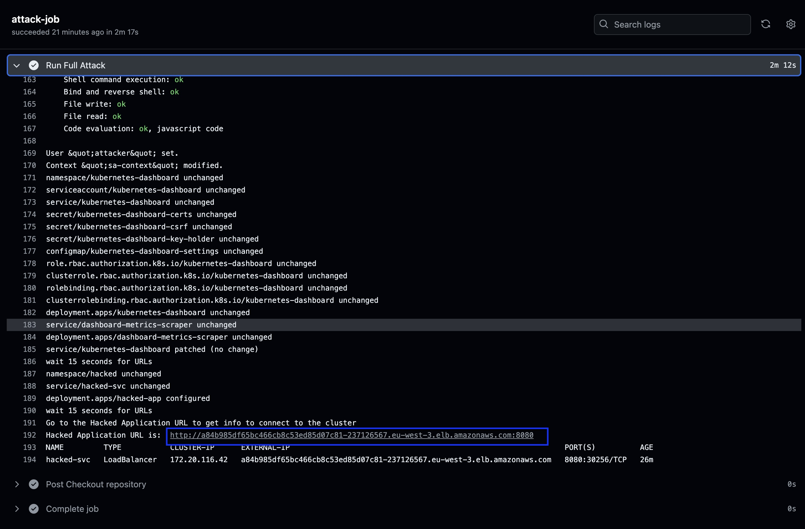

# Kubernetes Exploitation Demo 


### Objectives

This repository provides a laboratory for demonstrating the risk of a vulnerable application combined with overly permissive access deployed on a Kubernetes cluster.

In the ever-evolving landscape of digital infrastructure, Kubernetes stands tall as a cornerstone of modern application deployment. 
However, with great power comes great responsibility, and the perils of overly permissive access can cast a shadow over this powerful tool.


#### Requirements

- a Kubernetes cluster (Vanilla or managed) : you can use the following link to deploy an EKS cluster: https://github.com/cleypanw/terraform-aws-eks
- Fork this repository


## Architecture

Compromising an application running on the cluster and use its service account token to perform a **privilege escalation attack**


## Sequence Diagrams

#### High level Sequence Diagram


## Roll out Demo

### 1 - Deploy vul-app on k8s cluster

1. Fork this repo, Go to **vul-app/k8s** and deploy app with yaml file

```shell
$ kubectl apply -f deploy-vul-app.yaml
serviceaccount/secret-sa created
clusterrolebinding.rbac.authorization.k8s.io/pod-sa-clusterrolebinding created
clusterrole.rbac.authorization.k8s.io/secret-role created
replicationcontroller/vul-app created
service/vul-app-svc created
```

2. Check that the application is running and accessible 

```shell
$ kubectl get all
NAME                READY   STATUS    RESTARTS   AGE
pod/vul-app-nhmzh   1/1     Running   0          58s

NAME                            DESIRED   CURRENT   READY   AGE
replicationcontroller/vul-app   1         1         1       58s

NAME                  TYPE           CLUSTER-IP       EXTERNAL-IP                                                               PORT(S)        AGE
service/kubernetes    ClusterIP      172.20.0.1       <none>                                                                    443/TCP        20d
service/vul-app-svc   LoadBalancer   172.20.181.148   a35ffdf61921e47299c905d536881c8c-1546501490.eu-west-3.elb.amazonaws.com   80:30399/TCP   58s
```

3. Open your browser and go to the LoadBalancer URL as shown in the output above.


The application is running and accessible. 
Let's start the attack.


### 2 - Run the Attack

The application, our security website, is now accessible from the Internet.

The first action of an attacker is to scan the application to detect any injection point.
In today's world, all scanning actions are automated within minutes by bots, or crawlers.

*For our demo, scan actions were automated in a pipeline (GitHub Action), using the SSTIMap tool.*


#### Scan the web app

From the repository **Go to Actions and Run 0_Scan_WebApp** workflow to trigger the scan:


Scan detected several injection points which we are now going to exploit (os cmd for the demo)


#### Run the Attack

The fully automated attack will exploit the [CVE-2023-42282](https://nvd.nist.gov/vuln/detail/CVE-2023-42282) vulnerability to compromise the application with an SSRF injection.

The attacker will take control of the container to deploy kubernetes tools (kubectl), use the cluster's misconfiguration to grant a permission elevation by elevating the token, then deploy several workloads (web-app, etc...) and become the master/owner of the Kubernetes cluster.


Go to **Actions / Workflows / 1_Run_Attack - Server-Side Request Forgery (SSRF)** 

Set the URL of the application to be attacked as a parameter (output of 1.2 Check that the application is running and accessible) and run the attack


At the end of the workflow, applications will be deployed and running and a cluster-admin token will be print as output:

- https Kubernetes-dashboard URL (Red Below)
- http Hacked application URL (Green Below)
- Cluster-admin Token (Blue Below)




**Click on the Hacked Application URL** from output of the GitHub Action, you will be redirect the application with information to access the underlying kubernetes Cluster (*There may be a delay until DNS propagation is complete. Less than a minute*)


**Click on Kubernetes Dashboard URL** to access the Kubernetes Dashboard
**Copy** the Token to login.

*You have now full access to the underlying Kubernetes Cluster.*
*You can perform administrative action, etc...*
*Remember that kube-api are not open to the world, only accessible in a private network (see HLD above).*


#### Access kubernetes-dashboard  

Open in browser, the https kubernetes Dashboard URL shows as output during the attack and uses cluster-admin token to log in 


You now have full graphical access to the entire cluster.
You are the cluster admin.
You can :

- delete applications
- deploy applications
- modify cluster parameters
- lock the cluster, etc...


*Note: if you have the warning below, trust the URL by typing `this is unsafe` in the Chrome browser page*


#### Access hacked application

Open in browser, the http hacked application URL.
The url is available in the github-action output of the attack or from the kubernetes dashboard in the hacked namespace.


### 3 - Tips

You can access the Kube API via the infected container.

You can run any kubernetes command (deploy, create, delete, etc...) via the GitHub actions 3 or 4.


## Cleaning the environment

Delete application deployment

```shell
$ kubectl delete -f deploy-vul-app.yaml
serviceaccount "secret-sa" deleted
clusterrolebinding.rbac.authorization.k8s.io "pod-sa-clusterrolebinding" deleted
clusterrole.rbac.authorization.k8s.io "secret-role" deleted
replicationcontroller "vul-app" deleted
service "vul-app-svc" deleted
serviceaccount "cluster-admin-sa" deleted
clusterrolebinding.rbac.authorization.k8s.io "admin-clusterrolebinding" deleted
```

Delete namespaces created during the attack

```shell
$ kubectl delete ns hacked kubernetes-dashboard
```


### Appendix 

#### High level Sequence Diagram


#### Low level Sequence Diagram


#### Token analysis

Check the token information from [jwt.io](https://jwt.io/)


Please keep this token to log in kubernetes dashboard URL or to communicate with the K8s cluster api through the infected container to run other specific command:
